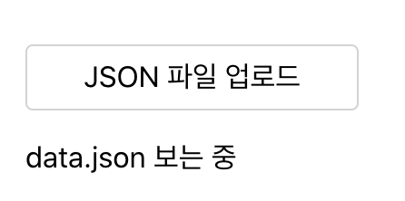
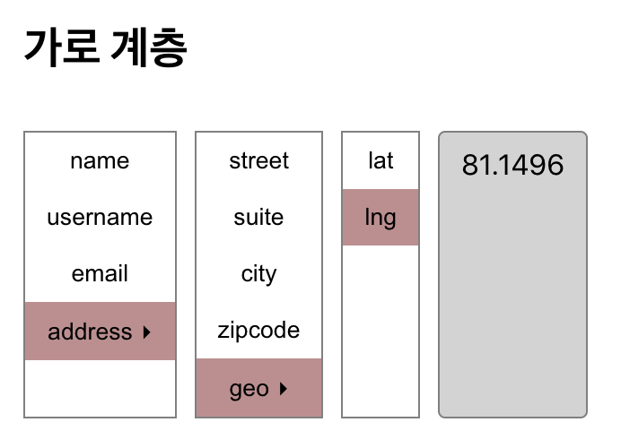
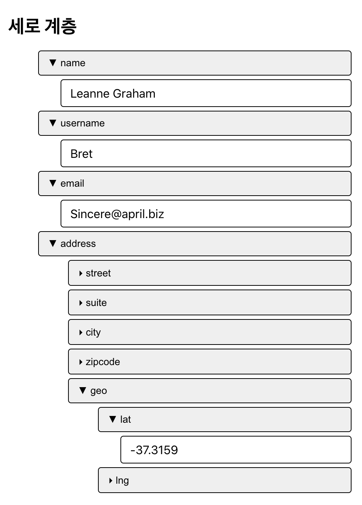

# JSON navigator

## 실행
```
npm i
```
```
npm start
```

## 사용 기술
- React
- TypeScript
- scss

## 구현 기능

### JSON 파일 업로드
- 업로드 전에는 기본 데이터로 보임
- 현재 보여주고 있는 파일명 표시



### 가로 계층
- 가로로 계층 구조를 보여줌
- 최하위 요소가 아닌 경우 ▸ 아이콘을 보여줌
- 선택되어 있는 요소를 표시



### 세로 계층
- 세로로 계층 구조를 보여줌
- 열려 있는 경우와 닫혀 있는 경우 다른 아이콘을 보여줌



